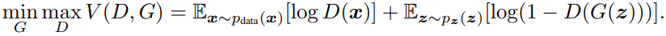
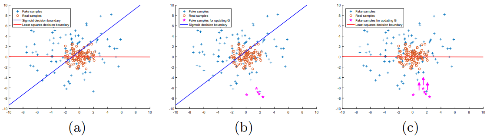
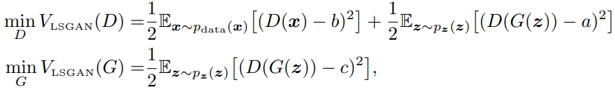
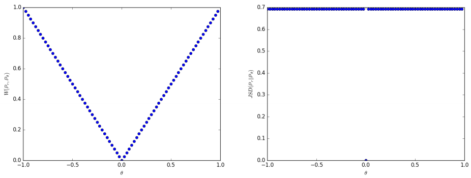
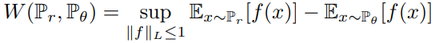
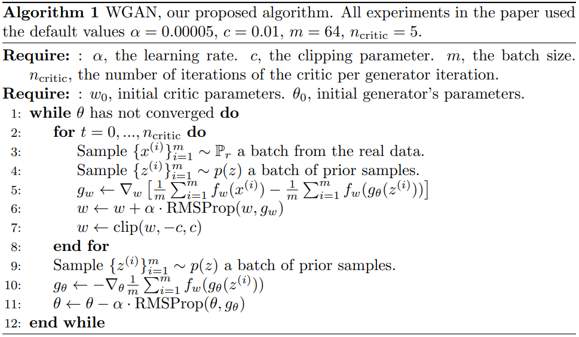
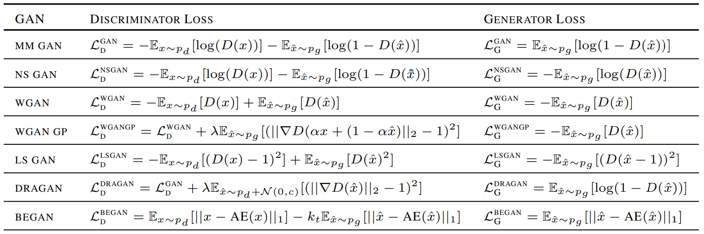

# **Compare GAN Losses by gan evaluating metrics**

In this repository, We evaluate the performance of the GAN's loss functions(ex. LSGAN or WGAN etc..) as an indicator of GAN performance such as **Inception Score(IS)** or **Frechet Inception Distance(FID)**.

We plan to use several datasets for accurate evaluation.

## **Directors structure**

```
Compare Gan Loss Function
+---[images]
|   +---...
|
+---[models]
|   +---__init__.py
|   |---original_gan.py
|   |---lsgan.py
|   |---wgan.py
|   |---wgan_gp.py
|
+---[utils]
|   +---__init__.py
|   |---fid.py
|   |---utils.py
|
|---main.py
```

## **GAN Losses**

Why GAN has many losses?

because of original GAN's problems

### **1. Oiginal GAN**

paper link: https://arxiv.org/abs/1406.2661

original gan loss function is:


many gan models suffer the following major problems:
- Non-convergence: the model parameters oscillate, destabilize and never converge
- Mode collapse: the generator collapses which produces limited varieties of samples
- Diminished gradient: the discriminator gets too successful that the generator gradient vanishes and learns nothing
- Unbalance between the generator and discriminator causing overfitting
- Highly sensitive to the hyper-parameter selections

### **2. LSGAN**

paper link: https://arxiv.org/abs/1611.04076

Least Square Generative Adversarial Network, or LSGAN for short, is an extension to the GAN architecture that addresses the problem of **vanishing gradients** and **loss saturaton**.



It is motivated by the desire to provide a signal to the generator about fake samples that are far from discriminator model's decision boundary for classifying them as real or fake. The further the generated images are from the decision boundary, the larger the error signal provided to generator, encouraging the generation of more realistic images.

The LSGAN can be implemented with a minor change to the output layer of the disciminator layer and the adoption of the least squares, or L2, loss function.


least square gan loss function is:


### **3. WGAN**

paper link: https://arxiv.org/abs/1701.07875

Wasserstein Generative Adversarial Network, or WGAN for short, is a GAN variant which uses the 1-Wasserstein distance, rather than JS-Divergence, to measure the difference between the model and target distributions. This prevents the GAN mode collapse problem.








### **4. WGAN-GP**
will update


## **GAN Evaluating Metrics**

### **1. Inception Score (IS)**
will update

### **2. Frechet Inception Distance (FID)**

paper link: https://arxiv.org/abs/1706.08500


FID(Frechet Inception Distance) is a performance metric to evaluate the similarity between two dataset of images. It is shown to correlate well to human evaluation of image quality, and it is able to detect intra_class mode collapse.

This implementation uses a different Inception v3 model from that what used in the original implementation. Not comfirmed, but we believe pytorch uses the Inception v3 model from 2016-08-28, while the original FID implementation uses a network from 2015-12-05. However, we are sure there will be no big difference. **But, it may be different from the results of the papers due to the difference in model weight.** So, if you want to report FID scores in your paper, you should consider using the official Tensorflow implementation.

The code is avaliable: here

The images must be **int8** between 0-255, or **float32** between 0-1 and all images are of same image shape. In this implementation, we reshape images to (299, 299) for fid input.

### **Usage**

To compute the FID score between two datasets, where images of each dataset are contained in an individual folder:

```python
python fid.py --path1 path/to/real/data --path2 path/to/fake/data --batch-size 8

```

## TODO
- [ ] add models
This is the models moving forward: 


- [ ] get inception v3 weight for FID from the official Tensorflow FID implementaiton
- [ ] add more datasets
- [ ] add GAN Ensembling
- [ ] add more evaluation metrics
- [ ] cleaning code